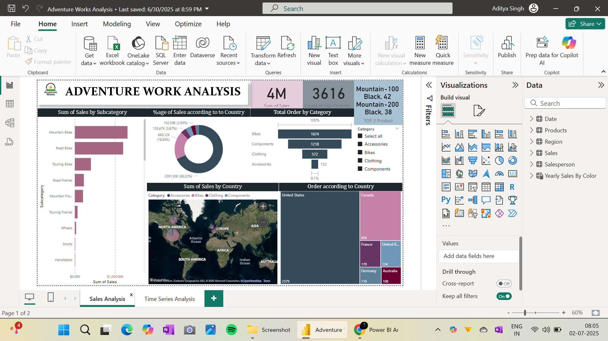
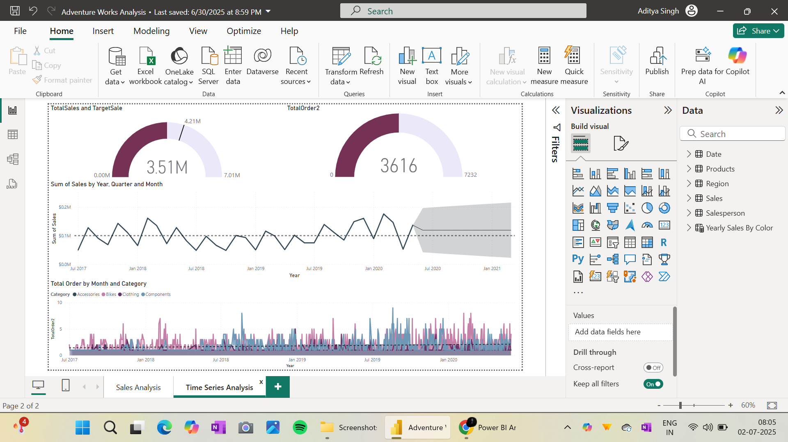

# 📊 Adventure Works Sales Analysis - Power BI Dashboard

  
  

## 📁 Project Overview

This Power BI dashboard presents a comprehensive sales analysis using the Adventure Works dataset. It includes product performance, geographic insights, and time-series trends to enable effective data-driven decisions.

---

## 📌 Objectives

- Analyze sales performance by product subcategory
- Identify top-selling countries and product categories
- Visualize total sales and order trends over time
- Compare actual vs target sales goals
- Build an interactive, user-friendly business intelligence report

---

## 📂 Dataset Source

- **Adventure Works DW** sample dataset
- Contains fictional sales data for bikes and accessories
- Key tables: Products, Region, Date, Salesperson, Sales Orders

---

## 📈 Dashboard Features

### 🔹 Page 1: Sales Analysis
- Bar chart: Sum of Sales by Subcategory
- Donut chart: % of Sales by Country
- Cards: Total Sales (4M+), Total Orders (3616)
- Highlight: Top 2 Products
- Treemap: Order Count by Country
- Map: Geographic sales distribution

### 🔹 Page 2: Time Series Analysis
- Line Chart: Monthly and Quarterly Sales Trends
- Gauge: Total Sales vs Target
- Clustered Column Chart: Orders by Category and Month
- Forecast visualization with confidence interval

---

## 🛠️ Tools Used

- Microsoft Power BI
- DAX (Data Analysis Expressions)
- Power Query (ETL)
- Adventure Works sample dataset

---

## 🚀 How to Use

1. Download the file.
2. Open the file .pbix in **Power BI Desktop**.
3. Interact with visuals, slicers, and tooltips to explore insights.
4. Refresh the data if needed.

---

## 💡 Key Insights

- **Mountain Bikes** account for over **68% of total sales**.
- The **United States** leads in order volume.
- Sales are steady year-round with minor seasonal variation.
- Accessories category has the fewest orders.

---

## 🙋 Author

**Aditya Kumar Singh**  
🔗 [LinkedIn](www.linkedin.com/in/aditya-kumar-singh-990377291)

---
